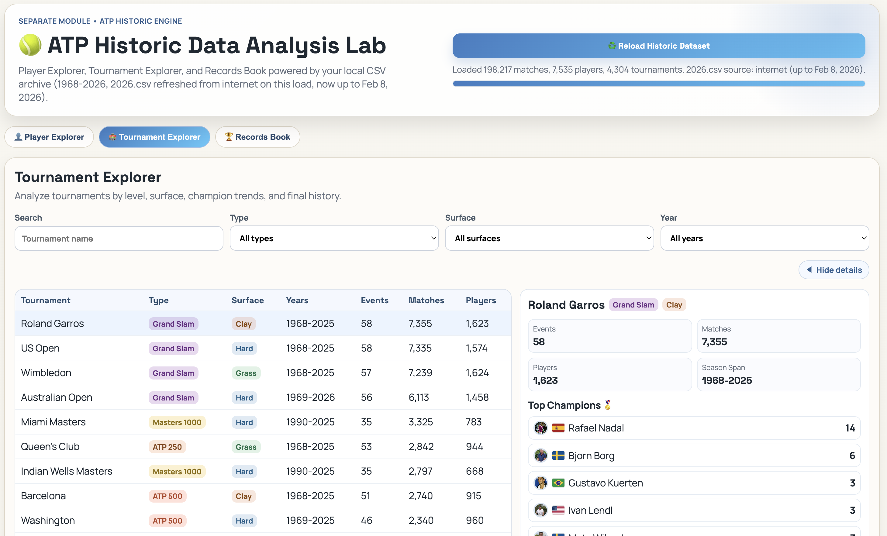

# 🎾 Tennis Live Dashboard

**Real-time ATP & WTA Tennis Tracking for the 2026 Season**

[](https://www.python.org/)
[](https://flask.palletsprojects.com/)
[](LICENSE)
[](https://tennis-tour-dashboard.onrender.com)

*Your all-in-one tennis companion for live scores, rankings, tournament insights, player analytics, and smart notifications.*

---

## ✨ Features

### 🔴 Live Match Tracking
- Real-time ATP/WTA live scores with server/game-point context.
- Auto-refresh via SocketIO with polling fallback.

### 📊 Match Coverage
- Recently finished matches with quick stat breakdowns.
- Upcoming matches (next 2 days) with H2H/prediction insights.

### 🏆 Rankings & Tournaments
- ATP/WTA rankings with update status and refresh actions.
- Tournament calendar + bracket viewer with round points/prize context.

### ⚔️ H2H Analytics
- ATP and WTA search + head-to-head comparison.
- Surface splits, trends, and radar-style metrics.

### 👤 Player Profiles
- Profile cards, country flags, image fallback, and stat summaries.
- Match-level details integrated with dashboard views.

### 📈 Data Analysis Dashboard
- Dedicated ATP/WTA analysis workspace (`/analysis/atp`, `/analysis/wta`).
- Player Explorer, Tournament Explorer, and Records Book.

### 🔔 Smart Notification System
- Multi-rule alert engine with guided rule builder.
- Event types for upcoming/live/result/milestone-style triggers.
- Channels: Email + integrations, cooldowns, quiet hours, run-now testing.
- Launchable from main dashboard button (auto-start helper route).

---

## 🚀 Quick Start

### 🌐 Live Demo
Visit: **[tennis-tour-dashboard.onrender.com](https://tennis-tour-dashboard.onrender.com)**

### 💻 Local Development

#### Option A: Quick Start Script

```bash
./start.sh
```

#### Option B: Manual Setup

Backend:

```bash
cd backend
python3 -m venv venv
source venv/bin/activate  # Windows: venv\Scripts\activate
pip install -r requirements.txt
python app.py
```

Frontend (new terminal):

```bash
cd frontend
python3 no_cache_server.py
```

Default local URLs:
- Frontend: `http://localhost:8085`
- Backend: `http://localhost:5001`
- Notification app: `http://localhost:5090`

---

## 🛠️ Tech Stack

### Backend
- Python 3.11+
- Flask + Flask-SocketIO
- Requests / BeautifulSoup / Playwright-based data flows

### Frontend
- HTML/CSS/Vanilla JS (modular files)
- Interactive charts/visualizations + custom UI components

### Deployment
- Render.com (Python service)
- GitHub for source and CI flow

---

## 📡 API Endpoints

### Core Endpoints

| Method | Endpoint | Description |
|---|---|---|
| `GET` | `/api/health` | Health check ✅ |
| `GET` | `/api/live-scores?tour=atp\|wta\|both` | Live match scores 🔴 |
| `GET` | `/api/recent-matches?tour=...&limit=...` | Recently completed matches 📋 |
| `GET` | `/api/upcoming-matches?tour=...&days=7` | Upcoming matches 🎯 |
| `GET` | `/api/intro-gifs` | Intro GIF list 🖼️ |

### Rankings & Players

| Method | Endpoint | Description |
|---|---|---|
| `GET` | `/api/rankings/<tour>?limit=...` | ATP/WTA rankings 🏆 |
| `GET` | `/api/rankings/atp/status` | ATP rankings status ⏰ |
| `POST` | `/api/rankings/atp/refresh` | Refresh ATP rankings 🔄 |
| `GET` | `/api/rankings/wta/status` | WTA rankings status ⏰ |
| `POST` | `/api/rankings/wta/refresh` | Refresh WTA rankings 🔄 |
| `GET` | `/api/player/<id>` | Player profile 👤 |
| `GET` | `/api/player/<tour>/<player_id>/image` | Player image route 📸 |

### Tournaments & Brackets

| Method | Endpoint | Description |
|---|---|---|
| `GET` | `/api/tournaments/<tour>` | Tournament calendar 📅 |
| `GET` | `/api/tournament/<id>/bracket?tour=...` | Tournament bracket 🌳 |
| `GET` | `/api/categories` | Category list 🏷️ |

### Head-to-Head

| Method | Endpoint | Description |
|---|---|---|
| `GET` | `/api/h2h/atp/search?query=...&limit=...` | ATP player search 🔍 |
| `GET` | `/api/h2h/wta/search?query=...&limit=...` | WTA player search 🔍 |
| `GET` | `/api/h2h/atp?player1_id=...&player2_id=...` | ATP H2H ⚔️ |
| `GET` | `/api/h2h/wta?player1_id=...&player2_id=...&year=2026&meetings=5` | WTA H2H ⚔️ |

### System Management

| Method | Endpoint | Description |
|---|---|---|
| `GET` | `/api/system/analysis` | Update analysis summary 📈 |
| `POST` | `/api/system/update` | Trigger update pipeline 🔄 |
| `GET` | `/api/system/update/status` | Update progress 📊 |
| `GET` | `/api/notifications/status` | Notification service status 🔔 |
| `POST` | `/api/notifications/launch` | Launch notification service 🚀 |
| `GET` | `/notifications/open` | Open notification page 🌐 |

### 🔔 Notification System Endpoints (port `5090`)

| Method | Endpoint | Description |
|---|---|---|
| `GET` | `/api/state` | State: settings/rules/history/config ⚙️ |
| `POST` | `/api/settings` | Save delivery settings 📝 |
| `GET` | `/api/options` | Player/tournament options 🔍 |
| `POST` | `/api/rules` | Create rule ✨ |
| `PUT` | `/api/rules/<rule_id>` | Update rule 🔧 |
| `DELETE` | `/api/rules/<rule_id>` | Delete rule 🗑️ |
| `POST` | `/api/run-now` | Manual run 🚀 |
| `POST` | `/api/test-email` | Send test email 📧 |
| `POST` | `/api/history/clear` | Clear run history 🔄 |

---

## 📁 Project Structure

```bash
Tennis-Dashboard/
├── backend/
│   ├── app.py
│   ├── tennis_api.py
│   ├── config.py
│   ├── requirements.txt
│   └── notification_system/
│       ├── app.py
│       ├── storage/subscriptions.json
│       ├── templates/index.html
│       └── static/{app.js,styles.css,favicon.svg}
├── frontend/
│   ├── index.html
│   ├── update.html
│   ├── no_cache_server.py
│   ├── css/
│   ├── js/
│   └── vendor/
├── data/
├── data_analysis/
├── scripts/
├── Images/
├── start.sh
├── start_local.sh
├── README.md
├── LICENSE
└── .gitignore
```

---

## 📸 Interface Gallery

| Title | Preview | Description |
|---|---|---|
| Loading Intro |  | Intro/loading screen. |
| Main Interface |  | Main dashboard layout. |
| Main Interface (Alt) |  | Alternate dashboard composition. |
| Upcoming Match Insights |  | Upcoming card with insights. |
| Live Rankings and Calendar |  | Rankings + calendar + bracket workspace. |
| Favourites Panel |  | Favourite players side panel. |
| H2H Analytics View 1 |  | First H2H analysis screen. |
| H2H Analytics View 2 |  | Detailed H2H comparison screen. |
| Player Stats Card 1 |  | Player profile card style 1. |
| Player Stats Card 2 |  | Player profile card style 2. |
| **Stats Table** |  | Tabular stats comparison layout. |
| **Serving Stats Index** |  | Serving metrics index view. |
| Notification System |  | Notification rules + controls page. |
| Notification System (Detail) |  | Notification detail workflow view. |

---

## 📊 Data Analysis Dashboard

| Title | Preview | Description |
|---|---|---|
| Player Analysis |  | Core player analysis workspace. |
| Player Analysis - Additional View |  | Additional player perspective. |
| Player Analysis - Advanced Metrics |  | Advanced metrics panel. |
| Player Match Analysis |  | Match-level player analysis. |
| Tournament Analysis |  | Tournament explorer screen. |
| Records Book |  | Historical records and holders. |
| Ranking Points Analysis |  | Ranking points trends. |

---

## 🔄 Data & Script Notes

- Live scripts update score/match caches.
- Update scripts refresh player profiles, rankings, tournaments, and derived stats.
- Some update flows use browser automation (`playwright install chromium`).

---

## 📄 License

MIT License — see [LICENSE](LICENSE).

---

<p align="center"><strong>⭐ Star this repo if you find it useful! ⭐</strong></p>
<p align="center">
  <a href="https://github.com/maninka123/Tennis-tour-dashboard/stargazers"></a>
  <a href="https://github.com/maninka123/Tennis-tour-dashboard/network/members"></a>
</p>
<p align="center">Made with 🎾 and ☕ | © 2026 Tennis Dashboard</p>
